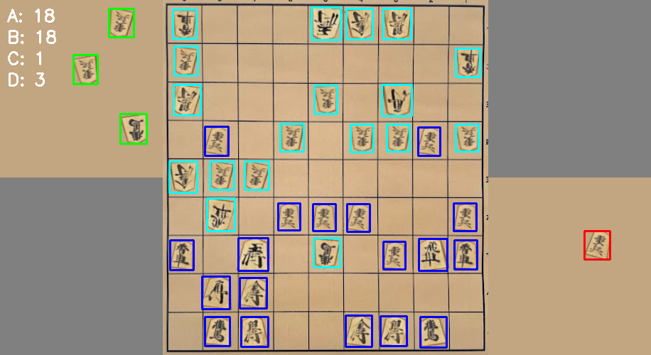

# Shogi Piece Detection with YOLO



## Overview
This project implements Shogi piece detection using a YOLO (You Only Look Once) object detection model. It enables automatic recognition of Shogi pieces from images or video, which can be used for game digitization, analysis, or computer vision applications related to Japanese chess.

## Project Structure

```
    ├── train.py            # Main training script for Shogi piece detection
    ├── main.py             # Entry point/inference script
    ├── data.yaml           # Dataset configuration with Shogi piece classes
    ├── changelabel.py      # Script to modify/transform Shogi piece labels
    ├── train/              # Training dataset of Shogi pieces
    │   └── images/         # Training images of Shogi boards/pieces
    ├── valid/              # Validation dataset
    │   └── images/         # Validation images
    │       └── classes.txt # Shogi piece class definitions
    ├── output/             # Training results and model outputs
    └── assets/             # Project assets (images, etc.)
        └── yolo_detection_example.png  # Example image for README
```

## How It Works

This Shogi piece detector uses YOLO ("You Only Look Once") and works by:
1. Dividing the Shogi board image into a grid
2. For each grid cell, predicting bounding boxes around pieces and their class (piece type)
3. Applying confidence thresholds to filter detections
4. Using Non-Maximum Suppression to eliminate duplicate detections

## Requirements
- Python 3.8+
- PyTorch
- Ultralytics YOLO
- CUDA-compatible GPU (for faster training)

## Installation

    # Clone this repository
    git clone <repository-url>
    cd <repository-directory>

    # Install dependencies
    pip install ultralytics torch torchvision

## Dataset Preparation
1. Organize your Shogi piece images into train and validation sets
2. Update `data.yaml` with Shogi piece class names and dataset paths
3. Use `changelabel.py` if you need to transform existing labels

## Training
Run the training script to train your Shogi piece detection model:

    python train.py

This will train a YOLO model with the following configuration:
- Model: yolo11n.pt
- 200 epochs
- Batch size: 16 (optimized for memory efficiency)
- Image size: 640
- Learning rate: 0.0001
- FP16 precision

Training progress and results will be saved to the `output` directory.

## Memory Optimization
The training script includes memory optimization techniques:
- CUDA memory cache clearing
- Half-precision training (FP16)
- Caching optimization

If you're experiencing memory issues, you can:
- Further reduce batch size
- Uncomment and adjust the memory fraction setting
- Reduce image size
- Use gradient accumulation

## Running Inference
Use `main.py` to run inference on new Shogi board images:

    python main.py --source <path-to-image-or-directory>

## Customization
- Modify `data.yaml` to change Shogi piece classes or dataset paths
- Adjust training parameters in `train.py` based on your requirements

## License
MIT LICENSE